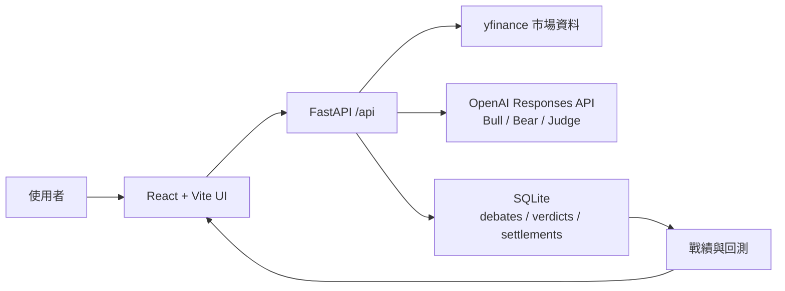

# AI 投資多空辯論擂台

Bull vs Bear Arena 是一個本機執行的投資判斷訓練工具：使用者輸入 ticker，系統用 yfinance 驗證標的與價格，再由多頭、空頭與裁判 AI 產生兩輪辯論、來源查核與評分。使用者必須先盲判站邊，之後才揭曉裁判分數；所有判斷會寫入 SQLite，並在戰績頁用後續真實價格回測。

## 技術棧

- 後端：Python FastAPI
- 前端：React + Vite + Tailwind CSS
- 資料庫：SQLite
- 市場資料：yfinance
- LLM：OpenAI API，預設模型 `gpt-5.6-luna`
- 執行方式：本機 `uvicorn` + `vite dev`

## 專案結構

```text
backend/
  app/
    main.py          FastAPI routes
    market_data.py   yfinance ticker validation and prices
    debate.py        OpenAI debate, rebuttal, and judge generation
    database.py      SQLite persistence, records, and settlements
  tests/
frontend/
  src/
    App.jsx          Main UI
    i18n.js          zh-Hant / en dictionary
scripts/
  demo_seed.py       Demo records seed
screenshots/
  01_home.png
  02_debate.png
  03_records.png
```

## 架構圖



## 安裝

在專案根目錄執行：

```powershell
python -m venv .venv
.\.venv\Scripts\pip.exe install -r backend\requirements.txt
Copy-Item .env.example .env
```

編輯 `.env`，至少設定：

```dotenv
OPENAI_API_KEY=your_api_key_here
OPENAI_USER_API_KEY=
OPENAI_KEY_SOURCE=default
OPENAI_DEBATE_MODE=api
OPENAI_MODEL=gpt-5.6-luna
DATABASE_PATH=data/app.db
```

也可以啟動前後端後，到前端右上方「設定」頁調整辯論模式、API key 來源與模型名稱。

- `OPENAI_KEY_SOURCE=default`：使用後端預設的 `OPENAI_API_KEY`，方便開發者本機測試。
- `OPENAI_KEY_SOURCE=user`：使用前端設定頁貼上的 `OPENAI_USER_API_KEY`，方便使用者換成自己的 key。
- `OPENAI_DEBATE_MODE=api`：正常呼叫 OpenAI 產生辯論。
- `OPENAI_DEBATE_MODE=demo`：使用固定範例辯論與裁判資料，不呼叫 OpenAI，適合 API quota 用完時測試與錄影。

前端不會把 key 存進 localStorage；設定會送到本機 FastAPI 後端並寫入 repo root 的 `.env`，下一次辯論會使用新的 key/model/mode。

安裝前端依賴：

```powershell
Set-Location frontend
npm.cmd install
Set-Location ..
```

## 本機啟動

開啟第一個終端機啟動後端：

```powershell
.\.venv\Scripts\uvicorn.exe app.main:app --app-dir backend --host 127.0.0.1 --port 8000 --reload
```

開啟第二個終端機啟動前端：

```powershell
Set-Location frontend
npm.cmd run dev -- --host 127.0.0.1 --port 5173
```

瀏覽器開啟：

```text
http://127.0.0.1:5173
```

健康檢查：

```powershell
Invoke-RestMethod http://127.0.0.1:8000/api/health
```

若 `8000` 被舊的後端 process 佔住、無法清掉，可改用替代 port：

```powershell
.\.venv\Scripts\uvicorn.exe app.main:app --app-dir backend --host 127.0.0.1 --port 8010
```

前端改成直連該後端：

```powershell
Set-Location frontend
$env:VITE_API_BASE_URL="http://127.0.0.1:8010"
npm.cmd run dev -- --host 127.0.0.1 --port 5174
```

## Demo Seed

Demo seed 會寫入 5 筆「7 天前的假想判斷」，並用 yfinance 抓真實歷史價格完成結算，方便立即展示戰績頁。

```powershell
.\.venv\Scripts\python.exe scripts\demo_seed.py --demo-seed
```

資料會寫入 `.env` 的 `DATABASE_PATH`，預設是 `data/app.db`。本機資料庫已被 `.gitignore` 排除。

## Demo 模式錄影

如果 OpenAI API 額度不足，仍可完整展示產品流程：

1. 啟動前後端。
2. 到右上方「設定」頁，將「辯論模式」切到 `Demo 模式` 後儲存。
3. 回首頁搜尋 `NVDA`，按「開始辯論」。
4. 畫面會顯示兩輪辯論、盲判面板、送出後揭曉裁判評分，全程不消耗 OpenAI API credits。
5. 需要展示戰績頁時，先執行 `scripts/demo_seed.py --demo-seed`。

## 測試

後端測試：

```powershell
.\.venv\Scripts\python.exe -m pytest backend\tests -q
```

前端測試與 build：

```powershell
Set-Location frontend
npm.cmd test
npm.cmd run build
Set-Location ..
```

## 主要 API

- `GET /api/health`
- `GET /api/tickers/{ticker}`
- `POST /api/debates/round-one`
- `POST /api/debates/two-round`
- `POST /api/debates/judged`
- `POST /api/verdicts`
- `GET /api/records`
- `GET /api/settings/openai`
- `POST /api/settings/openai`

## 截圖

- `screenshots/01_home.png`
- `screenshots/02_debate.png`
- `screenshots/03_records.png`

## Codex 使用說明

## English Summary for Judges

Bull vs Bear Arena is a local investment judgment training app. A user enters a ticker, reviews a two-round bull-vs-bear debate, makes a blind verdict before seeing judge scores, and later checks whether that judgment was right using real market prices. The product focuses on decision records, judge source checks, and backtesting rather than trading execution.

### Quickstart

```powershell
python -m venv .venv
.\.venv\Scripts\pip.exe install -r backend\requirements.txt
Copy-Item .env.example .env
Set-Location frontend
npm.cmd install
Set-Location ..
```

Run the backend:

```powershell
.\.venv\Scripts\uvicorn.exe app.main:app --app-dir backend --host 127.0.0.1 --port 8000 --reload
```

Run the frontend:

```powershell
Set-Location frontend
npm.cmd run dev -- --host 127.0.0.1 --port 5173
```

Open `http://127.0.0.1:5173`.

### Judge Testing Path

If OpenAI API quota is unavailable, open the Settings page and switch Debate Mode to `Demo Mode`. Demo Mode uses deterministic sample debate and judge data, so judges can test ticker lookup, the debate UI, blind verdict flow, judge reveal, and scoreboard behavior without spending API credits.

To seed settled scoreboard records:

```powershell
.\.venv\Scripts\python.exe scripts\demo_seed.py --demo-seed
```

### How Codex and GPT-5.6 Were Used

Codex was used throughout the project as the primary engineering partner: scaffolding the FastAPI and React/Vite app, implementing yfinance ticker validation, designing the SQLite schema, building the two-round debate flow, adding judge scoring, writing tests, debugging OpenAI provider errors, adding BYOK settings, and tightening local CORS/dev-port behavior.

GPT-5.6 was used in the intended product path as the bull, bear, and judge model. The prompts require structured JSON output validated by the backend with Pydantic schemas. During development, GPT-5.6/Codex also shaped the product decisions around blind judging, demo fallback, and API-key handling.

Key decisions made during the build:

- Keep the app local-first with SQLite, because the hackathon demo does not need accounts, deployment, or brokerage integrations.
- Make blind verdict submission happen before judge scores are revealed, because the core product is judgment training rather than passive AI advice.
- Store user-provided API keys only in the local backend `.env`, not in browser localStorage or the SQLite record database.
- Add Demo Mode so the full product can be tested and recorded even when OpenAI API quota is exhausted.

### Built With

Python, FastAPI, React, Vite, Tailwind CSS, SQLite, yfinance, OpenAI API, Codex, GPT-5.6.
