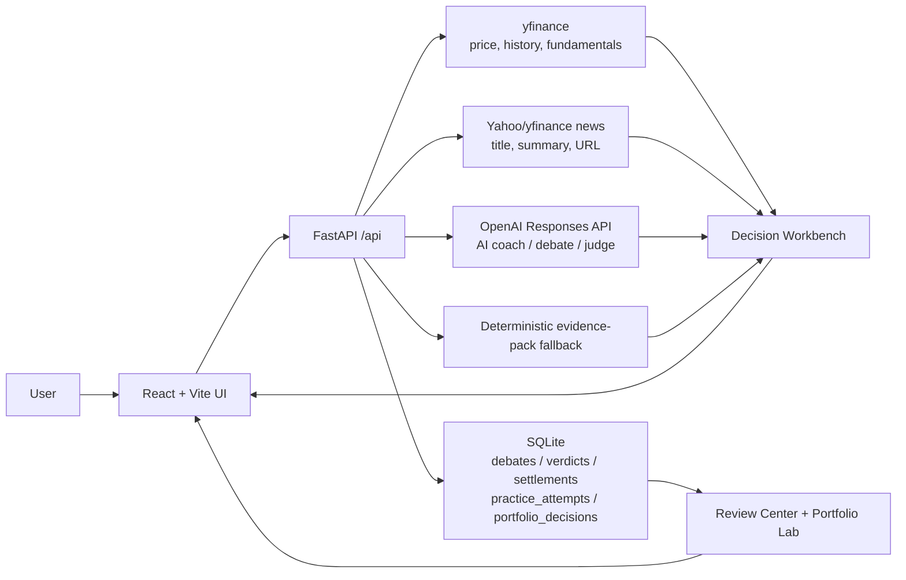

# Alpha Gym

**Train investment judgment with AI, historical replay, and real outcome review.**

Alpha Gym is a local-first investment decision gym. It does not tell users what to buy. Instead, it places users inside a past or live market snapshot, asks them to make a blind judgment, then uses GPT-powered debate, coaching, and real price outcomes to help them learn when to trust AI, when to challenge it, and how their own reasoning actually performs.

The original project started as **Bull vs Bear Arena**. It has evolved into a broader AI-era decision training product with four work areas:

- **Market Replay**: practice on past market dates without seeing future prices.
- **Live Decision Desk**: analyze a current ticker with the same workbench layout.
- **Portfolio Lab**: save live or manual decisions with entry price, time, rationale, and review notes.
- **Review Center**: inspect practice answers, live judgments, calibration, and recurring weaknesses.

> This project is for education and decision training only. It is not financial advice, a brokerage tool, or an order execution system.

## Why It Matters

Most finance tools produce answers. Alpha Gym trains the human layer before the answer is accepted.

The product loop is:

1. Replay or load a market situation.
2. Review price action, technical indicators, fundamentals, news/theme context, and AI-generated arguments.
3. Make your own call first: bull, bear, or neutral.
4. Record confidence, rationale, and evidence weights.
5. Reveal real outcomes, AI debate, judge scoring, and coach feedback.
6. Revisit the record later to see whether your reasoning improved.

The key design principle is **decide before reveal**. AI is used as an opposition partner and coach, not as an oracle.

## Core Features

### Market Replay

Market Replay drops the user into a past market date and hides future prices until after submission.

- Random historical drills across stocks, Taiwan tickers, and crypto-style symbols supported by the local data layer.
- K-line price chart with MA5, MA10, MA20, Bollinger Bands, volume average, KD, and MACD toggles.
- A fixed hover inspector above the chart, so daily OHLC and indicator values do not cover the chart itself.
- Evidence tabs for technical, fundamental, news/theme, and AI usage context.
- Practice submission with side, confidence, rationale, and technical/fundamental/AI weighting.
- Coach feedback that is GPT-first in API mode and uses the user's actual answer, rationale, weights, correct side, and outcome.

### Live Decision Desk

Live Decision Desk turns a current ticker into the same decision workbench used in Market Replay.

- Ticker or company-name search with dropdown suggestions, such as `NVDA`, `NVIDIA`, `台積電`, `TSMC`, `Bitcoin`, or `BTC-USD`.
- Latest yfinance snapshot, 30-day price series, chart indicators, fundamentals, and news/theme cards.
- AI Debate panel with bull opening, bear opening, cross-examination, and judge scoring.
- Save decision to Portfolio Lab with the current price, side, confidence, rationale, and AI agreement.

### Portfolio Lab

Portfolio Lab tracks current or manual decisions over time.

- Create decisions from Live Decision Desk.
- Add manual records directly in Portfolio Lab for decisions made outside the app.
- Edit or delete portfolio records.
- Track entry price, current price, current move, status, rationale, and review notes.

### Review Center

Review Center separates two different learning records:

- **Practice Answer Records**: historical drills, answer result, rationale, weights, and coach feedback.
- **Live Judgments**: saved debate/verdict records and later price settlements.

This keeps the review experience clear instead of mixing practice answers with real-time decisions in one crowded table.

### Bull vs Bear AI Debate

The debate layer is still part of the product, but it now serves the workbench.

- Bull and Bear each produce 3 evidence-backed opening claims.
- Each side produces 2 rebuttals that target the opponent's claim IDs.
- Judge scores evidence specificity, source quality, and logic from 1 to 5.
- Schema validation is enforced in the FastAPI backend with Pydantic.
- Output language follows the UI language setting.

### GPT-First With Transparent Fallback

In `OPENAI_DEBATE_MODE=api`, the AI workbench tries OpenAI first:

- AI dimension summaries.
- AI Debate content.
- Judge scoring.
- Personalized practice coach feedback.

If OpenAI quota, billing, model access, schema, or provider errors block the request, the app falls back to deterministic evidence-pack analysis. The frontend shows a source label such as `openai:<model>`, `deterministic_ai_coach`, or a fallback reason, so judges can tell what generated the content.

In `OPENAI_DEBATE_MODE=demo`, the app does not call OpenAI. This mode exists so the full local demo can still be evaluated when API quota is unavailable.

## Tech Stack

- **Backend**: Python, FastAPI, Pydantic
- **Frontend**: React, Vite, Tailwind CSS
- **Database**: SQLite
- **Market data**: yfinance
- **LLM path**: OpenAI Responses API, configurable model
- **Default local model value**: `gpt-5.6-luna`
- **Runtime**: local `uvicorn` + `vite dev`

The model name is configurable because judge or developer accounts may expose different model aliases.

## Architecture



## Project Structure

```text
backend/
  app/
    main.py           FastAPI routes
    market_data.py    ticker lookup, yfinance snapshots, price history
    practice.py       historical drills, indicators, AI coach, AI debate
    live_analysis.py  live workbench and portfolio decisions
    debate.py         original two-round bull/bear/judge flow
    database.py       SQLite persistence and settlement refresh
    settings.py       local OpenAI/BYOK configuration
  tests/
frontend/
  src/
    App.jsx           main app UI
    i18n.js           zh-Hant / en dictionary
scripts/
  demo_seed.py        seed settled records for demos
  render_competition_video.ps1
submission_assets/
  competition_video_script_en.md
  competition_video_subtitles_en.srt
```

## Setup

From the repository root:

```powershell
python -m venv .venv
.\.venv\Scripts\pip.exe install -r backend\requirements.txt
Copy-Item .env.example .env
Set-Location frontend
npm.cmd install
Set-Location ..
```

Edit `.env`:

```dotenv
OPENAI_API_KEY=your_default_api_key_here
OPENAI_USER_API_KEY=
OPENAI_KEY_SOURCE=default
OPENAI_DEBATE_MODE=api
OPENAI_MODEL=gpt-5.6-luna
DATABASE_PATH=data/app.db
```

Configuration notes:

- `OPENAI_KEY_SOURCE=default`: use backend `OPENAI_API_KEY`.
- `OPENAI_KEY_SOURCE=user`: use a user-provided key saved to the local `.env`.
- `OPENAI_DEBATE_MODE=api`: GPT-first AI features, with deterministic fallback on provider failure.
- `OPENAI_DEBATE_MODE=demo`: no OpenAI calls; deterministic demo content only.

The frontend does not store API keys in `localStorage`. API settings are sent to the local FastAPI backend and written to the local `.env`.

## Run Locally

Start the backend:

```powershell
.\.venv\Scripts\uvicorn.exe app.main:app --app-dir backend --host 127.0.0.1 --port 8000 --reload
```

Start the frontend in another terminal:

```powershell
Set-Location frontend
npm.cmd run dev -- --host 127.0.0.1 --port 5173
```

Open:

```text
http://127.0.0.1:5173
```

Health check:

```powershell
Invoke-RestMethod http://127.0.0.1:8000/api/health
```

If port `8000` is busy, run the backend on another port:

```powershell
.\.venv\Scripts\uvicorn.exe app.main:app --app-dir backend --host 127.0.0.1 --port 8010
```

Then point Vite to that backend:

```powershell
Set-Location frontend
$env:VITE_API_BASE_URL="http://127.0.0.1:8010"
npm.cmd run dev -- --host 127.0.0.1 --port 5174
```

## Judge Testing Path

Recommended path with a working OpenAI API key:

1. Open the app and click the `API: ok/error` button.
2. Choose `OpenAI API`, set a usable model, and save the key source.
3. Go to **Market Replay** and run a random historical drill.
4. Inspect the chart, evidence tabs, and AI Debate.
5. Submit a judgment with a rationale.
6. Confirm that coach feedback references the submitted answer and that AI source labels show `openai:<model>` when available.
7. Go to **Live Desk**, search a ticker or company name, then save the live judgment to **Portfolio Lab**.
8. Review records in **Review Center**.

Quota-safe path:

1. Click `API: ok/error`.
2. Switch to `Demo Mode`.
3. Run Market Replay, Live Desk, Portfolio Lab, and Review Center without spending OpenAI API credits.

Seed settled records for a richer demo:

```powershell
.\.venv\Scripts\python.exe scripts\demo_seed.py --demo-seed
```

## API Endpoints

- `GET /api/health`
- `GET /api/tickers/search?q=...`
- `GET /api/tickers/{ticker}`
- `GET /api/practice`
- `POST /api/practice/attempts`
- `PATCH /api/practice/attempts/{attempt_id}`
- `DELETE /api/practice/attempts/{attempt_id}`
- `GET /api/live-analysis/{ticker}`
- `GET /api/portfolio`
- `POST /api/portfolio/decisions`
- `PATCH /api/portfolio/decisions/{decision_id}`
- `DELETE /api/portfolio/decisions/{decision_id}`
- `POST /api/debates/round-one`
- `POST /api/debates/two-round`
- `POST /api/debates/judged`
- `POST /api/verdicts`
- `GET /api/records`
- `PATCH /api/records/{verdict_id}`
- `DELETE /api/records/{verdict_id}`
- `GET /api/settings/openai`
- `POST /api/settings/openai`

## Tests

Backend:

```powershell
.\.venv\Scripts\python.exe -m pytest backend\tests -q
```

Frontend:

```powershell
Set-Location frontend
npm.cmd test
npm.cmd run build
Set-Location ..
```

## Competition Video

The English competition video can be regenerated locally:

```powershell
.\scripts\render_competition_video.ps1
```

Expected output:

```text
submission_assets/generated/competition_video/alpha_gym_competition_captioned_en.mp4
```

The video uses English narration, burned-in English captions, and a subtle local sound-design track. Generated MP4 files are ignored by Git; the script and text assets are committed so the video can be reproduced.

## How Codex and GPT-5.6 Were Used

Codex was used as the main engineering collaborator for:

- Scaffolding the FastAPI and React/Vite app.
- Designing the SQLite schema for debates, verdicts, settlements, practice attempts, and portfolio decisions.
- Implementing yfinance ticker validation, keyword ticker search, and historical market snapshots.
- Building the decision workbench UI, chart controls, evidence panels, API settings, edit/delete flows, and bilingual i18n.
- Adding OpenAI structured JSON prompts, Pydantic validation, retry/fallback behavior, and provider error handling.
- Writing backend and frontend tests and debugging local dev-server/CORS issues.
- Producing the README, Devpost guidance, and competition video pipeline.

GPT-5.6 is used in the intended product path for:

- Bull and Bear debate generation.
- Judge evidence/source/logic scoring.
- AI dimension summaries inside Market Replay and Live Desk.
- Personalized coach feedback after a practice answer.

All GPT outputs requested by the backend use structured JSON and are validated before being returned to the frontend.

## Limitations

- Alpha Gym is not financial advice.
- No accounts, authentication, brokerage integration, deployment, Docker, or CI/CD are included.
- yfinance is used for local demo friendliness; availability and freshness depend on Yahoo/yfinance.
- Historical price data is point-in-time, but some fundamentals may be yfinance profile snapshots or demo proxies when historical fundamentals are not available.
- News/theme cards keep original URLs when available, but source availability varies by ticker and market.
- Demo Mode and deterministic fallback are clearly labeled and are not presented as live GPT output.

## 繁中摘要

Alpha Gym 是一個 AI 投資判斷訓練場，不是下單工具。使用者可以回到歷史市場某一天，在不偷看未來價格的情況下，閱讀 K 線、技術指標、基本面、新聞題材與 AI Debate，先做自己的看多/看空/觀望判斷，再揭曉真實後續走勢與教練回饋。即時分析則使用相同工作台，並可把當下決策存進 Portfolio，日後回來復盤。

## License

MIT License. See [LICENSE](LICENSE).
