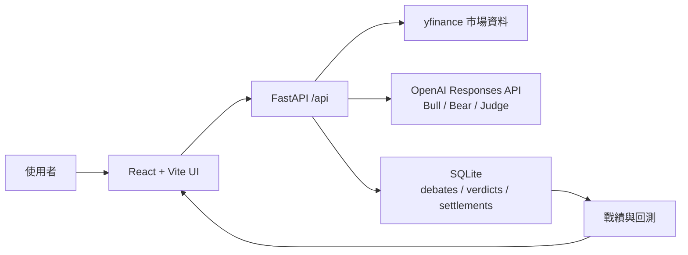

# AI 投資多空辯論擂台

Bull vs Bear Arena 是一個本機執行的投資判斷訓練工具：使用者輸入 ticker，系統用 yfinance 驗證標的與價格，再由多頭、空頭與裁判 AI 產生兩輪辯論、來源查核與評分。使用者必須先盲判站邊，之後才揭曉裁判分數；所有判斷會寫入 SQLite，並在戰績頁用後續真實價格回測。

## 技術棧

- 後端：Python FastAPI
- 前端：React + Vite + Tailwind CSS
- 資料庫：SQLite
- 市場資料：yfinance
- LLM：OpenAI API，預設模型 `gpt-5.6-luna`
- 執行方式：本機 `uvicorn` + `vite dev`

## 專案結構

```text
backend/
  app/
    main.py          FastAPI routes
    market_data.py   yfinance ticker validation and prices
    debate.py        OpenAI debate, rebuttal, and judge generation
    database.py      SQLite persistence, records, and settlements
  tests/
frontend/
  src/
    App.jsx          Main UI
    i18n.js          zh-Hant / en dictionary
scripts/
  demo_seed.py       Demo records seed
screenshots/
  01_home.png
  02_debate.png
  03_records.png
```

## 架構圖



## 安裝

在專案根目錄執行：

```powershell
python -m venv .venv
.\.venv\Scripts\pip.exe install -r backend\requirements.txt
Copy-Item .env.example .env
```

編輯 `.env`，至少設定：

```dotenv
OPENAI_API_KEY=your_api_key_here
OPENAI_MODEL=gpt-5.6-luna
DATABASE_PATH=data/app.db
```

安裝前端依賴：

```powershell
Set-Location frontend
npm.cmd install
Set-Location ..
```

## 本機啟動

開啟第一個終端機啟動後端：

```powershell
.\.venv\Scripts\uvicorn.exe app.main:app --app-dir backend --host 127.0.0.1 --port 8000 --reload
```

開啟第二個終端機啟動前端：

```powershell
Set-Location frontend
npm.cmd run dev -- --host 127.0.0.1 --port 5173
```

瀏覽器開啟：

```text
http://127.0.0.1:5173
```

健康檢查：

```powershell
Invoke-RestMethod http://127.0.0.1:8000/api/health
```

若 `8000` 被舊的後端 process 佔住、無法清掉，可改用替代 port：

```powershell
.\.venv\Scripts\uvicorn.exe app.main:app --app-dir backend --host 127.0.0.1 --port 8010
```

前端改成直連該後端：

```powershell
Set-Location frontend
$env:VITE_API_BASE_URL="http://127.0.0.1:8010"
npm.cmd run dev -- --host 127.0.0.1 --port 5174
```

## Demo Seed

Demo seed 會寫入 5 筆「7 天前的假想判斷」，並用 yfinance 抓真實歷史價格完成結算，方便立即展示戰績頁。

```powershell
.\.venv\Scripts\python.exe scripts\demo_seed.py --demo-seed
```

資料會寫入 `.env` 的 `DATABASE_PATH`，預設是 `data/app.db`。本機資料庫已被 `.gitignore` 排除。

## 測試

後端測試：

```powershell
.\.venv\Scripts\python.exe -m pytest backend\tests -q
```

前端測試與 build：

```powershell
Set-Location frontend
npm.cmd test
npm.cmd run build
Set-Location ..
```

## 主要 API

- `GET /api/health`
- `GET /api/tickers/{ticker}`
- `POST /api/debates/round-one`
- `POST /api/debates/two-round`
- `POST /api/debates/judged`
- `POST /api/verdicts`
- `GET /api/records`

## 截圖

- `screenshots/01_home.png`
- `screenshots/02_debate.png`
- `screenshots/03_records.png`

## Codex 使用說明
